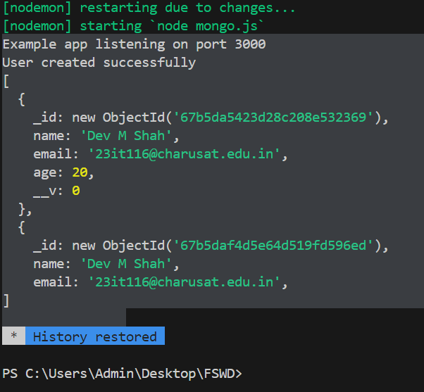

## Table of Contents

- [Introduction](#introduction)
- [MongoDB and NoSQL vs SQL](#mongodb-and-nosql-vs-sql)
- [Setting Up MongoDB](#setting-up-mongodb)
- [Node.js Project Setup](#nodejs-project-setup)
- [Installing and Configuring Mongoose](#installing-and-configuring-mongoose)
- [Project: User Profile Manager](#project-user-profile-manager)
- [Project: Task Manager API](#project-task-manager-api)
- [API Request Examples](#api-request-examples)
- [Conclusion](#conclusion)

---

## Introduction

In this tutorial, we cover:

- **What is MongoDB?**  
  An introduction to MongoDB as a NoSQL database.

- **NoSQL vs SQL Databases:**  
  A brief overview of the differences between document-based databases like MongoDB and relational databases.

---

## MongoDB and NoSQL vs SQL

- **What is MongoDB?**  
  MongoDB is a document-oriented NoSQL database used for high-volume data storage. It stores data in flexible, JSON-like documents instead of rigid tables.

- **NoSQL vs SQL:**  
  - **NoSQL Databases:**  
    - Schema-less design, ideal for unstructured data.
    - Easily scalable for large volumes of data.
  - **SQL Databases:**  
    - Utilize fixed schemas with tables and relationships.
    - Ideal for complex queries and transactional integrity.

---

## Setting Up MongoDB

- **Local Installation:**  
  Download and install MongoDB on your machine for development.

- **MongoDB Atlas:**  
  Alternatively, create a free cluster on [MongoDB Atlas](https://www.mongodb.com/cloud/atlas) to host your database in the cloud.

---

## Node.js Project Setup

## 📦 Install Dependencies:
Install the required packages:
```bash
npm install express mongoose dotenv
```

---

## 🔐 Environment Variables:
Create a `.env` file to securely store your MongoDB connection URI.

---

## 📁 Installing and Configuring Mongoose
Mongoose is an ODM (Object Data Modeling) library for MongoDB and Node.js. It simplifies data modeling by allowing you to define schemas and models. Steps include:

1. **Installing Mongoose**.
2. **Writing a connection script** to connect to your MongoDB database.
3. **Creating schemas and models** to represent your data.

---

## 💻 Project: User Profile Manager
### 🎯 Objective:
Set up MongoDB and Mongoose in a Node.js application and create a basic schema to perform simple database operations.

### ✅ Tasks

#### 1. **Install MongoDB or Create a Cluster:**
Set up MongoDB locally or via MongoDB Atlas.

#### 2. **Node.js Setup:**
Initialize a new Node.js project and install express, mongoose, and dotenv.

#### 3. **Environment Setup:**
Create a `.env` file with your MongoDB connection URI.

#### 4. **Database Connection:**
Write a script using Mongoose to connect to your database.

#### 5. **User Schema:**
Define a User schema with fields such as `name`, `email`, and `age`.

#### 6. **Database Operations:**
- **Insert a User:** Create a script to add a user and log the result.
- **Fetch Users:** Retrieve all users and display them in the console.

---

## 💡 Project: Task Manager API

### 🎯 Objective:
Build a RESTful API using Express and Mongoose to manage tasks stored in a MongoDB collection.

### ✅ Tasks

#### 1. **Define the Task Schema:**
Create a schema with fields like:
- `title`
- `description`
- `status` (e.g., "Pending", "Completed")
- `dueDate`

#### 2. **API Endpoints:**
Set up the following routes:
- **POST /tasks:** Add a new task.
- **GET /tasks:** Retrieve all tasks.
- **GET /tasks/:id:** Retrieve a specific task by ID.
- **PUT /tasks/:id:** Update a task's details.
- **DELETE /tasks/:id:** Delete a task.

#### 3. **Testing:**
Use tools like **Postman** or **Thunder Client** to test your API endpoints.

#### 4. **Querying and Error Handling:**
- Use filters to query tasks based on `status` or `dueDate`.
- Implement error handling for invalid IDs or missing fields.

---

## 🌐 API Request Examples

### **Task1**


### **GET Request**
Retrieve tasks from the API:


### **POST Request**
Add a new task to the database:


### **PUT Request**
Update a task:


### **Reflection in Database After PUT**
View the updated task in the database:


### **DELETE Request**
Delete a task:


### **Reflection in Database After DELETE**
Confirm the task deletion:


---

## 🚀 Conclusion
This tutorial demonstrated how to:

- Set up **MongoDB** and **Mongoose** in a **Node.js** application.
- Create and use basic schemas for managing **user profiles**.
- Build a **RESTful API** for a **Task Manager project** with complete **CRUD operations**.
- Test and validate **API endpoints** using common tools.
